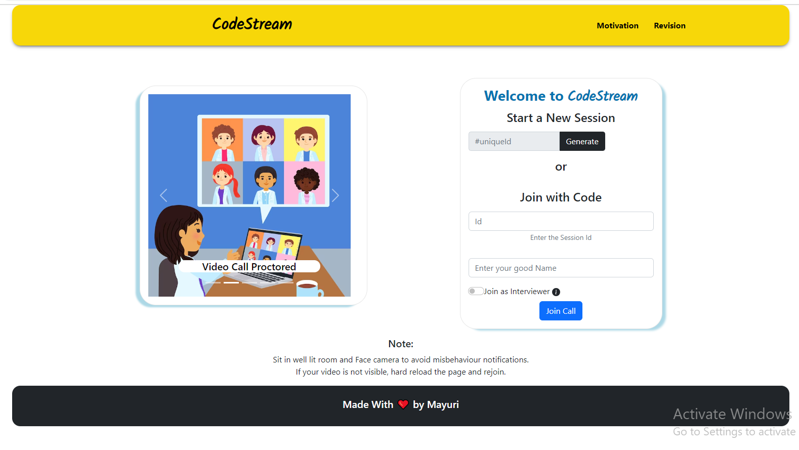
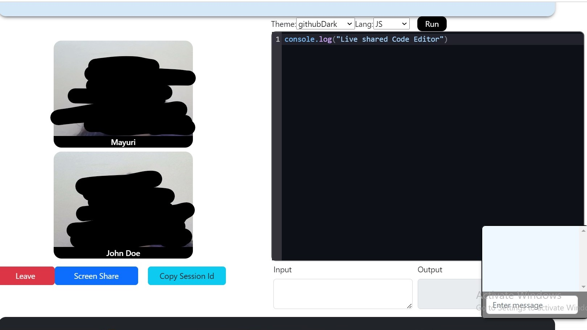

# CodeStream - Real-Time Code Collaboration Tool

**Introduction**  
CodeStream is a powerful real-time code editor that facilitates seamless collaboration among developers. With its intuitive user interface and a wide array of features, CodeStream empowers developers to work together effectively, regardless of their physical locations.

# Features 
**Live Code Editor**  
CodeStream provides a live code editor where multiple developers can collaboratively write, review, and debug code in real-time. This feature allows teams to work together efficiently, speeding up development cycles and improving code quality.

**Video Proctoring**  
CodeStream includes built-in video proctoring to facilitate online coding interviews and remote pair programming. With video proctoring, you can conduct technical interviews, assess candidates' coding skills, and monitor progress during pair programming sessions.

**Live Chat**  
CodeStream comes with a live chat feature that enables instant communication between team members. Developers can share code snippets, ask questions, and discuss ideas, fostering a collaborative and productive development environment.

**Screen Share**  
Collaborating effectively often requires more than just sharing code. CodeStream's screen share feature allows developers to share their screens, enabling better understanding of codebases, troubleshooting, and providing support to team members.

**Online Compiler**  
CodeStream provides an online compiler that supports multiple programming languages, enabling developers to quickly test and run code without leaving the editor. This feature helps catch errors early and accelerates the development process.

**Intuitive UI**  
CodeStream's user interface is designed to be intuitive and user-friendly. It offers a smooth learning curve, making it easy for developers of all experience levels to adapt and collaborate seamlessly.

# Screenshots

